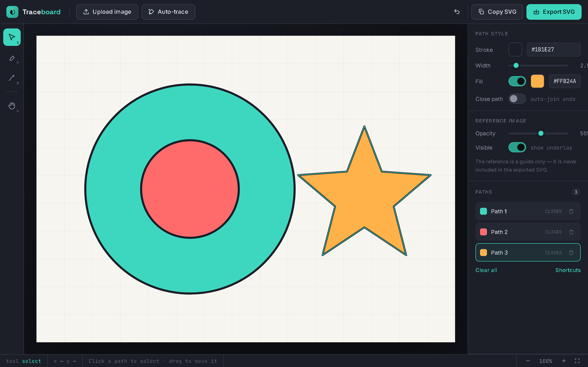

# Traceboard

Trace an image into clean vector paths right in your browser, using a real bezier pen tool, and export it as SVG. No sign-up, no install, no file ever leaves your machine.



## Features

- **Pen tool** — click for straight corners, drag for smooth bezier curves, snap-close by clicking the first anchor
- **Pencil tool** — freehand drawing, auto-simplified and smoothed into a clean curve on release
- **Auto-trace** — one-click vectorization of a whole image as a starting point, powered by [ImageTracer.js](https://github.com/jankovicsandras/imagetracerjs)
- **Select & move** — click any path to select it, drag to reposition, delete, or restyle it
- **Layer-aware fills** — a shape drawn on top of another punches a hole in it wherever they overlap, so rings, donuts, and cutouts render correctly without any manual boolean/path-subtraction work
- **Reference image underlay** — drop in a photo, logo, or sketch to trace over, with adjustable opacity; it's a guide only and never ends up in the export
- **Path style controls** — per-path stroke color/width, fill color, and closed/open toggle
- **Undo, pan, zoom, keyboard shortcuts**
- **Export or copy** clean, dependency-free SVG
- **Installable** as a PWA — add it to your home screen or desktop and it opens like a native app

## Getting started

Traceboard is a static site — no build step, no dependencies to install.

```bash
git clone https://github.com/Squidly1408/Traceboard.git
cd Traceboard
```

Then just open `index.html` in a browser, or serve the folder locally:

```bash
npx serve .
```

> The app itself works fine opened directly from disk. Serving it over `http(s)` (even just locally) is only needed to get the full PWA experience — install prompts and the manifest don't activate over `file://`.

## Usage

1. **Upload image** (or drag & drop one onto the canvas) to use as a tracing reference.
2. Pick the **Pen** (`P`) or **Pencil** (`B`) tool and trace over it — or hit **Auto-trace** to get a rough vectorization to start from.
3. Switch to **Select** (`V`) to move, restyle, or delete individual paths.
4. **Export SVG** to download the file, or **Copy SVG** to grab the markup straight to your clipboard.

| Key | Action |
|---|---|
| `V` | Select tool |
| `P` | Pen tool |
| `B` | Pencil tool |
| `H` | Pan tool |
| `Enter` | Finish the current pen path |
| `Esc` | Cancel the current pen path / deselect |
| `Backspace` | Undo the last placed anchor while drawing |
| `Delete` | Delete the selected path |
| `Ctrl`/`Cmd`+`Z` | Undo |
| `0` | Fit view to canvas |
| `+` / `-` | Zoom in / out |

## Project structure

```
Traceboard/
├── index.html          # markup only
├── css/
│   └── styles.css
├── js/
│   └── app.js           # all app logic (state, rendering, tools, export)
├── assets/               # favicon, PWA icons, screenshot
└── manifest.json         # PWA manifest
```

No framework, no bundler, no package.json — everything runs as plain HTML/CSS/JS in the browser.

## Notes

- Auto-trace loads [ImageTracer.js](https://github.com/jankovicsandras/imagetracerjs) from a CDN on first use (jsdelivr, with unpkg as a fallback), so it needs an internet connection. The Pen and Pencil tools work fully offline.
- The fill "hole punch" behavior is order-dependent: a shape only cuts a hole into shapes drawn *before* it in the Paths list. A shape drawn first with something layered on top of it later will get punched; the reverse won't.

## License

No license has been set for this project yet.
